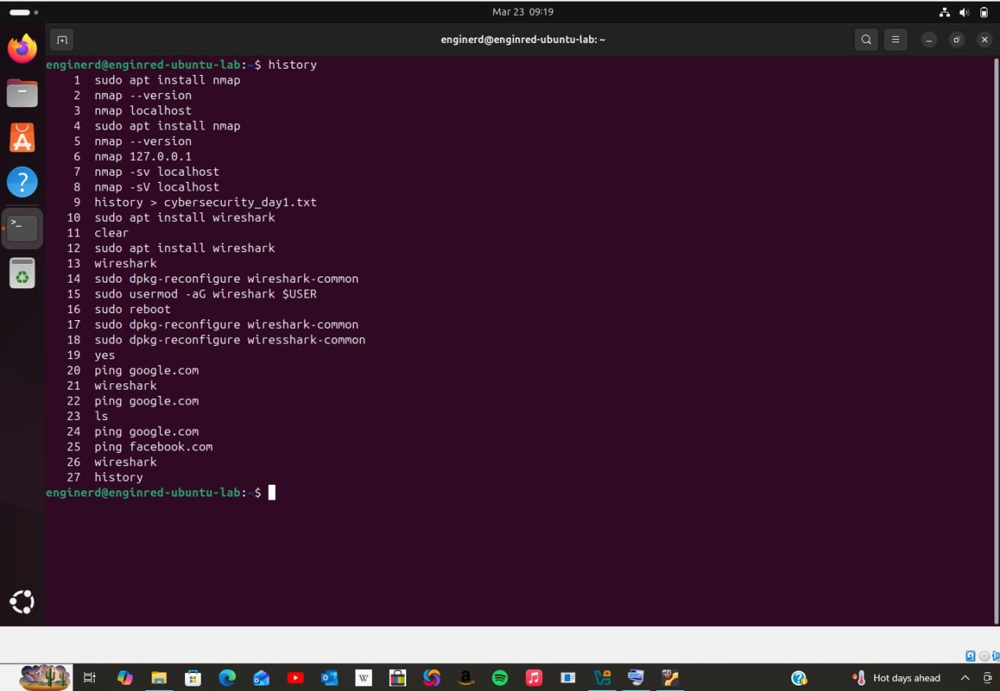
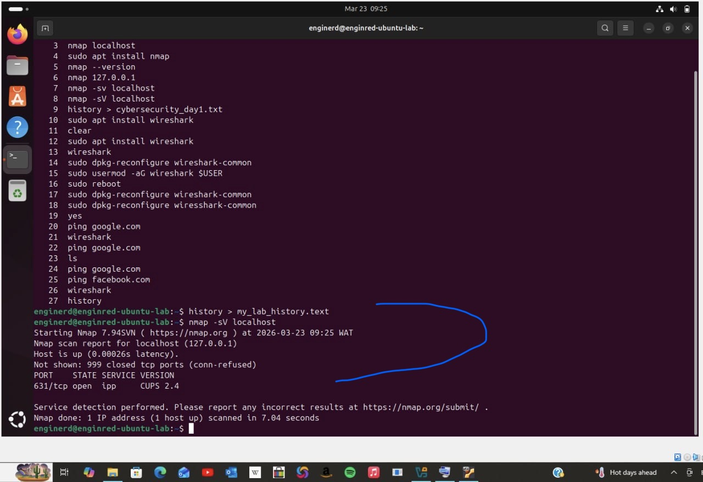
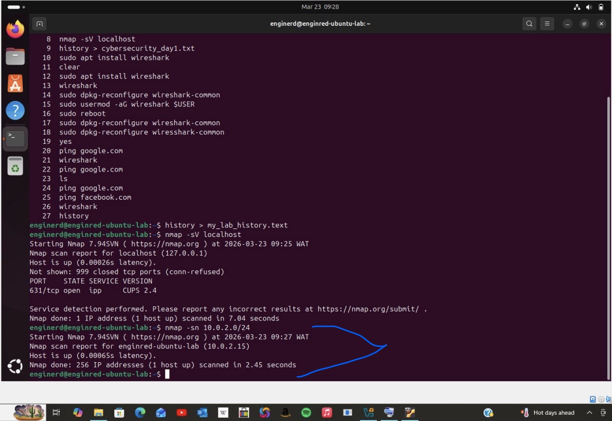
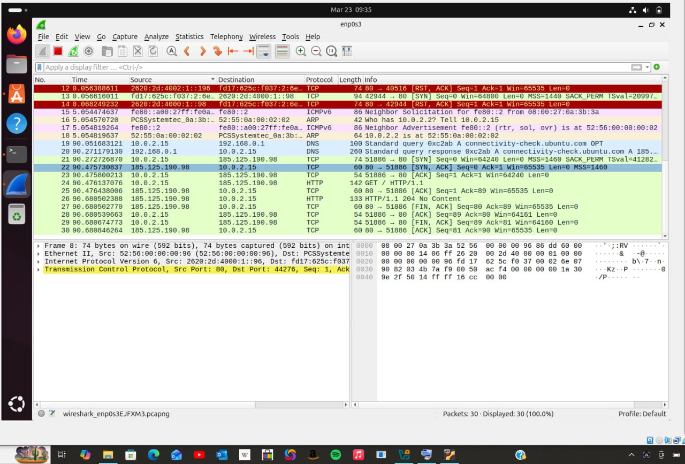
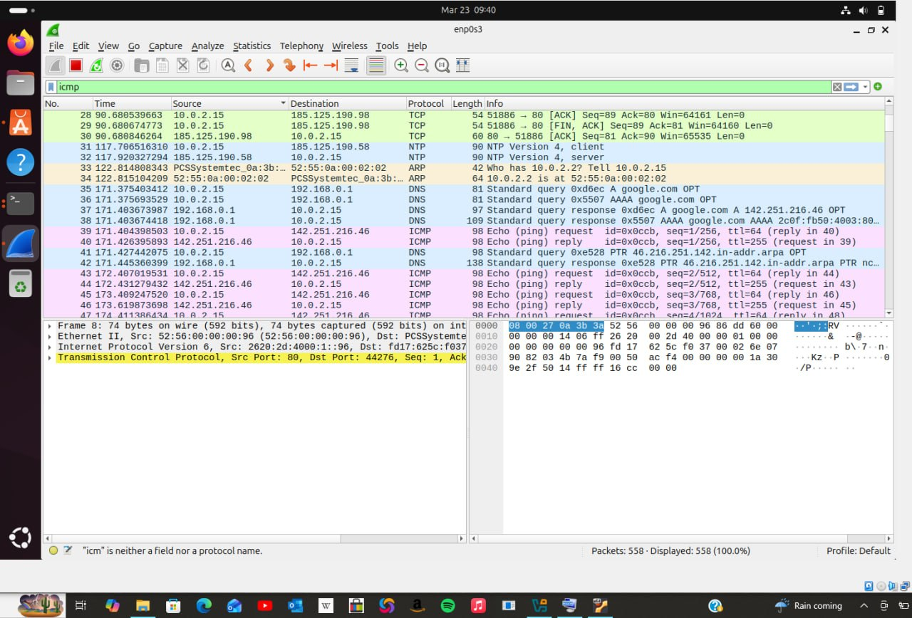
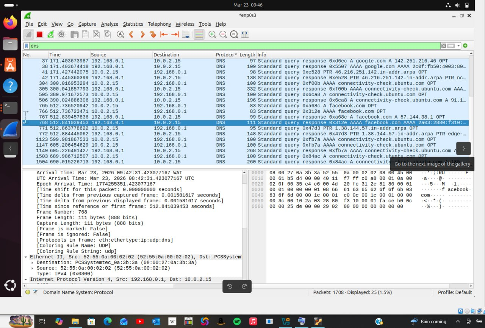

# 🔐 My Cybersecurity Journey

A documentation of my first hands-on cybersecurity project —
building a virtual lab and exploring real tools used in the field.

---

## 🧰 Tools Used
- Ubuntu Linux (VirtualBox)
- Nmap
- Wireshark

---

## 1. 💻 Virtual Lab Setup
- Installed Ubuntu Linux on a virtual machine
- Configured the environment for learning and experimentation

**Basic Linux commands practiced:**
- `pwd` – print working directory
- `ls` – list files
- `cd` – change directory
- Created directories and managed files


---

## 2. 📝 Saving Command History
To document all commands used during learning:

```bash
history > my_lab_history.txt




---

## 3. Network Scanning with Nmap
Scanned my local machine to see what services are running:

nmap -sV localhost
Results:
- Open ports
- Running services
- service versions (e.g., CUPS on port 631)

Lesson: every opn port is a potential entry  point. knowing what's exposed is the first step in securing a system.


---

## 4. Scanning My Local Network
 nmap -sn 10.0.2.0/24
Results:
- Active hosts on the network
- My machine's IP:10.0.2.15



---

## 5. Packet Capture with Wireshark
Installed and launched Wireshark to monitor live network traffic.
Observed:
- TCP handshakes (SYN,ACK)
- live network traffic capture
- filtered traffic by specific protocols
- Background system communications


Lesson: Data is constantly moving across networks, even when you're not actively browsing.


---

## 6. Filtering DNS Traffic
Applied  a DNS filter in wireshark:
DNS
Revealed:
- Domain requests (e.g., facebook.com)
-	IP resolutions in real time
-	DNS queries leaving and returning to my machine


✅ Key Takeaways
-	Network scanning helps uncover exposed services
-	Packet analysis shows how data flows in real time
- Filtering helps isolate important traffic
-	Documentation is essential for growth


